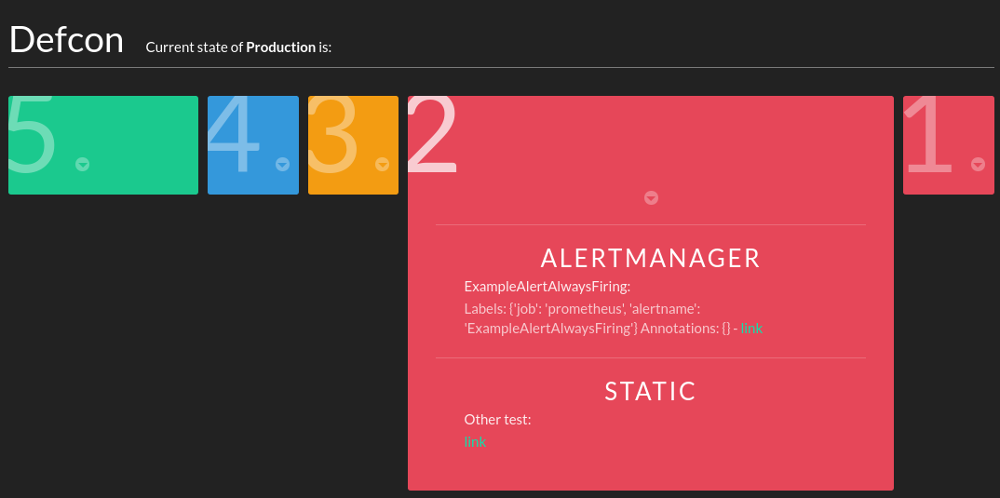

# DefCon

[](https://travis-ci.org/criteo/defcon)
[](https://coveralls.io/github/criteo/defcon?branch=master)
[](https://badge.fury.io/py/defcon-monitoring)

UI and API to show an aggregate status of your services. The idea of defcon is that it gathers the status of various components of your infrastructure and exposes them to both humans and machines. Humans (:couple:) will go to the UI to see if something is known to be wrong, and machines (:computer:) will consume the API. This could be used to automatically pause Jenkins job or Chef runs when the production looks unstable.

[](doc/defcon.png)

*This is currently under active development and not ready for production.*

## API

Simply go to `/api/defcon/<COMPONENT_ID>/`.

```json
GET /api/defcon/observability/
HTTP 200 OK
Allow: GET, OPTIONS
Content-Type: application/json
Vary: Accept

{
    "url": "http://defcon/api/components/observability/",
    "plugins": [
        {
            "url": "http://defcon/api/plugin_instance/4/",
            "statuses": [],
            "name": "alertmanager-page",
            "config": "{'receiver': 'observability-page', 'defcon': 2, 'api': 'https://alertmanager/'}",
            "plugin": "http://defcon/api/plugin/alertmanager/"
        },
        {
            "url": "http://defcon/api/plugin_instance/5/",
            "name": "alertmanager-ticket",
            "description": "",
            "config": "{'receiver': 'observability-ticket', 'defcon': 4, 'api': 'https://alertmanager/'}",
            "plugin": "http://defcon/api/plugin/alertmanager/"
        }
    ],
    "statuses": [],
    "defcon": 5,
    "name": "Observability",
    "description": "",
    "link": "https://confluence/display/OBS",
    "contact": "observability@iksaif.net"
}
```

There are also more things available on `/api/`.

## Plugins

See [defcon/plugins/README.md](defcon/plugins/README.md)

## Quickstart

```shell
virtualenv venv -p python3
source venv/bin/activate
cp examples/local_settings.py defcon/
pip install -r requirements.txt
./manage.py migrate
./manage.py migrate --run-syncdb
./manage.py createsuperuser
./manage.py loadplugins
./manage.py loadcomponents
./manage.py runplugins
./manage.py runserver
```
